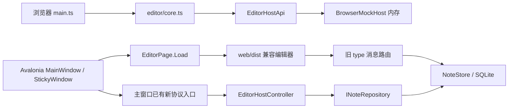

# LocalNotesMvp 项目全景

核对日期：2026-09-24，包含当前工作区修改。历史代码基准：`46ecbc1`。本文描述当前实现，后续设想单独标注；功能与文档不一致时，以实际入口、代码和测试为准。

## 1. 产品定位

从本地笔记和桌面便签起步，逐步建设支持稳定对象 ID、块树、双向链接、实时引用、局部覆写的笔记系统。新版浏览器已提供内存态自由画布；多平台、云同步、思维导图以及画布的真实数据库落盘仍是后续目标，不能当成当前已经完成。

桌面信息组织是：工作区 → 彩色书签 → 笔记文档 → 块树。文档与书签通过关联表连接，不能简单理解成数据库中每篇文档只能有一个书签。引用关系与真实父子关系也不是一回事。

优先级：保存可靠、对象身份稳定、操作符合直觉，然后才是更多呈现形式。引用应融入所在最小编辑单元，不把所有引用堆到文末，不用大色块反复强调“外部内容”。

## 2. 最重要的现状：有两条前端运行路径

| 路径 | 实际入口与构建 | 数据来源 | 当前边界 |
| --- | --- | --- | --- |
| 新版浏览器编辑器 | `editor/index.html` → `editor/src/main.ts`；Vite，端口 4173 | `BrowserMockHost` 内存 fixture | 新引用交互在这里开发；切换文档保留，刷新页面重置 |
| Avalonia 桌面兼容编辑器 | `EditorPage.Load()` 加载输出目录 `web/`；来源是 `web/dist` | C# `NoteStore` → SQLite | 保留工作区、书签、文档与便签；不是新版浏览器 UI |
| 新编辑器的原生接入入口 | `editor/src/desktop.ts` → `NativeHostTransport` | 设计上通过 Host API 接 C# | 文件已存在，但当前桌面构建没有把它替换成实际默认入口 |



不要把 `npm run build:editor` 当成更新桌面 EXE 的命令；它生成 `editor/dist`。桌面 `.csproj` 执行的是 `web/` 的 `npm run build`，生成并复制 `web/dist`。

### 当前 canonical 规则

为避免同一能力继续出现第二套状态，新版编辑器遵循以下唯一事实来源：

- **标题**：`Block.type="heading"` 表示标题块，`Block.properties.headingLevel` 表示 1–6 级；Markdown 中的 `#` 只是源码序列化。旧块没有等级时按 Markdown 推断，仍没有标记时默认为 H1。工具栏创建标题始终写入 `headingLevel: 1`。
- **分栏**：普通块通过 `properties.columnGroup`、`column` 和 `columnWidths` 组成列组；不存在独立的分栏容器块。旧的 `layout/columnCount/columnGap` 只允许在加载迁移时读取，保存不会再产生这些字段。
- **数据库块**：`data_sources/data_fields/data_records/data_values` 是数据唯一来源；正文块只保存 `properties.databaseId`，视图配置由 `databaseViews` 按数据库 ID 关联。旧 `databaseViewId` 只为兼容读取保留，新代码不得写入。
- **地理位置**：位置目录是 `GeoLocation` 的唯一事实来源，支持全局和笔记本 scope；正文 `type="location"` 块只保存 `properties.locationId` 与可选显示名称覆盖，地图管理负责坐标、地址和来源更新。
- **Canvas**：工作区项目以唯一 `kind=document|canvas|dashboard` 区分；Canvas 内的文档和 Canvas 节点只保存稳定目标 ID 与几何信息，是打开关系，不修改左侧目录 `parentId`。Canvas 的自由内容节点使用与正文相同的 `Block`（旧版 `text/content` 节点只在工作区边界兼容迁移），Canvas 只额外保存位置、尺寸、层级、引用显示偏好/自定义 Icon 和节点字号。Canvas 文档预览沿用正文标题层级折叠，曲线支持中点描述和 Icon 悬浮预览。嵌套引用建立时必须拒绝直接和间接循环。
- **Dashboard**：新版浏览器支持与文档、Canvas 平行的 `kind=dashboard` 工作区项目。Dashboard 使用专用视图；每个组件是 `Block.type="dashboard_widget"`，在 `properties.dashboardWidget` 中保存稳定组件实例 ID、组件类型、数据作用域、查询配置和布局，不保存渲染结果。组件通过 `DashboardWidgetRenderer` 注册表读取当前 `EditorState`，标题、移动、缩放、删除和新增均通过现有 `saveDocument` 版本/幂等保存路径完成。当前内置右栏引用、反向链接、覆写、注释、历史、日历、位置、样式和数据库的摘要组件；Mock 仍是内存实现，未接入桌面 SQLite。
- **链接与引用**：默认新建关联统一使用正文 `[[笔记本/文档/块#^块ID]]` 双链。六点菜单只复制这个稳定链接；用户在右栏普通双链条目中明确选择显示方式时，才把该链接升级为同一宿主块下的 `reference_instance`。已有 `reference_instances` 仍可展示、切换模式和编辑兼容内容。
- **作用域实现**：`editor/` 是当前新版网页入口，`web/` 是桌面兼容入口；两者不是同一运行时。新版先在 `BrowserMockHost` 验证交互，不能把 Mock 当成 SQLite 持久化实现，也不能为同一功能在两端各自发明一套模型。

Canvas 引用修复：新版 Canvas 的自由块在 Mock 文档索引中暴露同一 Block 对象，引用使用现有 `ReferenceInstance` 及 `create-reference/set-reference-mode/save-override` 命令。引用实例修改进入 Canvas 历史，源投影在读取时刷新，不写入块正文。Canvas 与文档共享 `link-suggestions.ts` 的笔记本/文档/块筛选和标题区间算法，并调用正文只读预览组件渲染文本、媒体、表格及位置。Canvas 当前提供标题链接、正文直显、折叠三种呈现，文本投影可双击编辑局部覆写；Canvas 打开后通过同一份 `EditorState` 驱动实时引用、反向链接、覆写、注释、历史、日历、地图、CSS 和数据库右栏，激活 Canvas 数据块时数据库面板跟随切换。布局、节点、引用实例、标题和视口由 Canvas 历史快照统一撤销/重做，右栏历史恢复使用同一快照；顶部前进/后退通过宿主导航栈切换 Canvas 与普通文档。

新增正文能力应先扩展上述 canonical DTO 和宿主命令，再接入渲染与 Mock；禁止把同一数据复制到正文内容、临时 UI 状态和另一张表中。兼容字段必须有明确的迁移入口和退役条件。

## 3. 技术栈与实际文件导航

桌面目标框架是 `net8.0`；依赖 Avalonia 11.0.0、WebView.Avalonia 11.0.0.1 和 Microsoft.Data.Sqlite 9.0.0。Windows 下使用 WebView2。前端是原生 TypeScript/DOM，没有 React、Vue 或第三方块编辑器框架。Vite 8、TypeScript、Playwright 安装在 `web/` 下，具体版本以 `web/package-lock.json` 为准。

| 文件/目录 | 当前职责 |
| --- | --- |
| [editor/src/core.ts](editor/src/core.ts) | 渲染、输入、保存队列、联想、链接预览、就地引用、模式转换、覆写与结构操作；目前仍是大文件 |
| [editor/src/main.ts](editor/src/main.ts) | 浏览器入口、Mock 初始化、开发导航栏、失败模拟和重试按钮 |
| [editor/src/browser-mock-host.ts](editor/src/browser-mock-host.ts) | Alpha/Beta 最小兼容锚点，以及 Gamma、Epsilon、演示中心、Zeta 等 Markdown/待办/数据库/位置/媒体 Demo；项目路线图与研究白板 Canvas 也在此提供浏览器态实现，另含内存保存、导航、侧栏树和引用命令；不是完整存储实现 |
| [editor/src/editor-host-api.ts](editor/src/editor-host-api.ts) | 请求 ID、响应匹配、Promise、10 秒超时、宿主事件订阅 |
| [editor/src/workspace-api.ts](editor/src/workspace-api.ts) | 侧栏只依赖类型化的快照、搜索、大纲和异步命令接口，不直接读写 Mock 或编辑器 DOM |
| [editor/src/browser-workspace.ts](editor/src/browser-workspace.ts) | 浏览器工作区适配；命令串行执行，等待编辑保存后修改数据，重命名/删除后同步当前编辑器。原生工作区适配尚未接入 |
| [editor/src/canvas-manager.ts](editor/src/canvas-manager.ts) | 新版无限画布视图；负责平移缩放、自由卡片、文档/Canvas 引用、节点六点菜单、字号与引用 Icon、移动缩放、预览/Icon 模式和画布历史交互 |
| [editor/src/dashboard-manager.ts](editor/src/dashboard-manager.ts) | 新版 Dashboard 视图；负责 `dashboard_widget` 容器块、组件注册表、布局拖动/缩放、右栏能力摘要渲染和保存队列 |
| [editor/src/mock-save-store.ts](editor/src/mock-save-store.ts) | Mock 保存幂等记录、版本规则和完整快照校验 |
| [editor/src/block-content.ts](editor/src/block-content.ts) | 正文序列化与 HTML 清理；剥离引用投影、保留空锚点 |
| [editor/src/markdown.ts](editor/src/markdown.ts) | 新版 Markdown 的安全渲染、旧 HTML 转源码、双链与引用锚点往返 |
| [editor/src/native-host.ts](editor/src/native-host.ts) | 集中访问 WebView 桥；固定接收入口 `window.localNotesHostReceive` |
| [protocol/types.ts](protocol/types.ts) | TypeScript DTO、请求/响应/事件和引用显示模式 |
| [protocol/ProtocolModels.cs](protocol/ProtocolModels.cs) | C# 消息信封及部分请求 DTO，并非完整生成式协议模型 |
| [protocol/protocol.md](protocol/protocol.md) | 协议 v1、引用锚点与模式约定 |
| [host/EditorHostController.cs](host/EditorHostController.cs) | 新协议路由到仓储、导航回调；`showNotification` 当前仅返回成功 |
| [host/MainWindowHostAdapter.cs](host/MainWindowHostAdapter.cs) | 主窗口的 Controller 适配器 |
| [host/StickyWindowHostAdapter.cs](host/StickyWindowHostAdapter.cs) | 已定义的便签适配器；不能据此声称便签已全面接入新协议 |
| [host/WebViewMessageChannel.cs](host/WebViewMessageChannel.cs) | JSON 解析、序列化，兼容被再次包装为 JSON 字符串的消息 |
| [host/EditorFlushCoordinator.cs](host/EditorFlushCoordinator.cs) | 主窗口与便签共用的保存排空请求匹配、并发等待、失败及超时处理 |
| [storage/INoteRepository.cs](storage/INoteRepository.cs) | 工作区、书签、文档、编辑器状态、事务保存和命令接口 |
| [storage/DomainModels.cs](storage/DomainModels.cs) | 目前仅有 schema 版本常量，完整领域模型尚未迁移到这里 |
| [src/LocalNotesMvp/Models.cs](src/LocalNotesMvp/Models.cs) | 当前 C# 对象与保存/引用请求模型 |
| [src/LocalNotesMvp/NoteStore.cs](src/LocalNotesMvp/NoteStore.cs) | 真正的 SQLite 建表、兼容迁移、读取、事务保存、覆写与实例树操作 |
| [src/LocalNotesMvp/NoteStore.Interactions.cs](src/LocalNotesMvp/NoteStore.Interactions.cs) | 稳定链接索引、链接目录、实例归属校验、命令分发、原子引用创建 |
| [src/LocalNotesMvp/NoteStore.Validation.cs](src/LocalNotesMvp/NoteStore.Validation.cs) | 事务内检查完整快照的块归属、作用域、唯一 ID、父块、循环和内容类型；不改变数据库布局 |
| [src/LocalNotesMvp/MainWindow.axaml.cs](src/LocalNotesMvp/MainWindow.axaml.cs) | 主窗口、工作区/书签 UI、历史导航、旧消息路由、新协议接入及验收入口 |
| [src/LocalNotesMvp/StickyWindow.axaml.cs](src/LocalNotesMvp/StickyWindow.axaml.cs) | 独立便签窗口，实际仍主要使用旧消息路由 |
| [src/LocalNotesMvp/EditorPage.cs](src/LocalNotesMvp/EditorPage.cs) | 读取兼容 HTML/CSS/JS 并内联到 WebView 页面 |
| [web/src/main.ts](web/src/main.ts) | 桌面兼容编辑器，独立于新版 `core.ts`；不能只改一处就宣称两端一致 |
| [web/build-assets.mjs](web/build-assets.mjs) | 复制兼容 HTML/CSS，并检查脚本使用的静态元素 ID |

`editor/host/protocol/storage` 是迁移边界，不是四个独立构建的 C# 项目。C# 文件通过现有 `.csproj` 的 `Compile Include` 接入。

## 4. SQLite 数据结构

真实业务数据在一个 SQLite 数据库中，按表分工，不按对象类型分成多个数据库，也不把全部字段横向拼成一张大表。

数据库路径优先级：`new NoteStore(path)` 参数 → `LOCAL_NOTES_MVP_DB` 环境变量 → `%LOCALAPPDATA%\LocalNotesMvp\notes.db`。连接开启外键与 WAL。`Load()` 会初始化、迁移并补齐默认数据，不是只读操作。

当前建表定义包含以下 14 张表；`GetTableCounts()` 的诊断结果未包含 `save_transactions`，不能以诊断输出的键数推断实际表数。

| 层次 | 表 | 核心内容 |
| --- | --- | --- |
| 组织 | `workspaces` | 名称、根路径等工作区信息 |
| 组织 | `bookmarks` | 工作区、名称、颜色、顺序 |
| 组织 | `document_bookmarks` | 文档和书签的关联 |
| 内容 | `documents` | 稳定 ID、标题、便签标志、工作区、文档保存版本、软删除 |
| 内容 | `blocks` | 文档、`parent_id`、`position`、类型、`content_json`、`properties_json`、块修订号、作用域；智能表块使用 `type=database_table` 和 `properties.databaseId` |
| 数据 | `data_sources/data_fields/data_records/data_values` | 笔记本级智能数据库、字段、记录和值；普通 GFM 表格仍属于 Markdown 内容 |
| 关系 | `links` | 源文档/块、目标文档/块、原始文本、别名与偏移；反向链接是查询结果 |
| 实例 | `reference_instances` | 引用出现位置、源文档/块、显示模式、更新/冲突策略；`host_block_id` 唯一 |
| 覆写 | `block_overrides` | 当前实例对源块内容/样式的补丁、基础修订号和基础内容 |
| 覆写 | `instance_tree_operations` | 插入、隐藏、移动等实例结构变更；保存目标、父块、位置与基础信息 |
| 历史 | `document_history` | 每篇文档最近 80 个版本、撤销/重做路径及游标；只包含自身内容和引用实例，随编辑事务保存 |
| 可靠性 | `save_transactions` | `(document_id, mutation_id)` 幂等记录和实际落库版本 |
| 预留视图 | `views` | 文档视图类型与设置 |
| 预留视图 | `placements` | 视图中的块坐标、尺寸、旋转和层次 |
| 预留视图 | `edges` | 文档/视图中块之间的边 |

`blocks.scope_type='canonical'` 表示真实内容；`reference_instance` 表示实例专属新增内容，`scope_id` 关联实例。`parent_id` 与 `position` 构成树与排序，`position` 是同一父块下的兄弟相对顺序；读取、保存和历史恢复都按稳定树先序展开，不能对整篇文档直接按 `position` 扁平排序。当前前端常以补零字符串顺序值排列，不是 CRDT 排序方案。

`documents.client_version` 用于保存事务，`blocks.revision` 用于源块修订与覆写通知。两者不能互换。`views/placements/edges` 仍是预留结构；新版浏览器 Canvas 当前由 Browser Mock 内存模型承载，不能据此推断已接入这些 SQLite 表或桌面端。

## 5. 保存链路与不可破坏的语义

新版普通编辑：DOM 输入 → `enqueueDocumentSave()` → 一个 in-flight 快照和一个可合并 queued 快照 → `EditorHostApi.saveDocument()` → Host → `NoteStore.SaveTransaction()` → SQLite 提交 → ACK。

保存请求携带 `documentId`、`mutationId`、`clientVersion`、标题和块快照。引用命令由独立 `commandTail` 串行队列发送，经 `executeCommand` 返回状态。切换前 `flush()` 等待两类队列；不能把定时器触发或请求发送视为保存成功。

当前 SQLite 的准确版本规则（Mock 使用同一组保存契约案例验证）：

1. 同一文档相同 mutation ID 重发，返回原提交版本，不重复写入。
2. 新 mutation 的请求版本必须大于当前持久化版本；小于或等于则拒绝。
3. 请求版本可以跳号，持久化版本统一为 `currentVersion + 1`，ACK 返回实际值。

这不是完整的多设备并发冲突算法，也不是“必须收到恰好 current+1 才能写”的实现。不要未经设计把版本校验改严或取消，历史保存故障与此直接相关。

错误恢复仍有边界：前端 NACK 路径会清理队列，浏览器开发页有手动重试按钮，缺少通用的持久化未保存草稿。主窗口与便签现共用 EditorFlushCoordinator，关闭前等待匹配的 flush 成功；失败或超时保留窗口。处理保存功能时需实际验证失败、导航与关闭，不能只看成功状态文本。

### 撤销、重做与版本历史

新版浏览器与桌面兼容编辑器均支持 Ctrl+Z、Ctrl+Y、Ctrl+Shift+Z，以及工具栏撤销/重做按钮。连续输入按编辑目标与约 900ms 停顿合并；粘贴、选区替换和结构操作分组。历史面板按时间列出最近 80 个版本，点击只预览标题和正文文本，点击“恢复此版本”才写入；恢复本身可以撤销。Canvas 在新版浏览器中使用独立的布局历史快照，但通过同一历史面板显示、恢复和按钮状态；快照包含节点、位置尺寸、视口、标题及引用实例。撤销后新编辑清空重做路径，但被分叉的版本在保留上限内仍可从列表恢复。

桌面 `NoteStore.History.cs` 在正文/引用变更的同一 SQLite 事务中记录历史，历史与游标可跨进程重启保留。恢复只接收当前文档所属的版本 ID，校验当前 `expectedVersion`，保留文档/块/实例 ID、软删除，并使文档版本与恢复块的 revision 前进。快照不包含被引用源文档的正文，恢复实例覆写、隐藏、移动和专属块不会修改源文档。恢复后的继承部分仍读取最新源。

`history-undo/history-redo/history-restore` 经 `executeCommand`（兼容端 `editor-command`）执行。恢复前排空保存与引用命令队列，恢复期间暂时锁定编辑区，等待 ACK 后才替换正文；NACK 保留原内容及历史位置。导航和关闭也等待历史操作结束。旧兼容引用操作现使用有 requestId 的命令 ACK/NACK，主窗口和便签响应使用相同 camelCase 序列化。

浏览器 Mock 历史与 fixture 一样仅保留在当前页面内存中，刷新即重置，不再把固定 fixture ID 的历史存入 localStorage。桌面新增 `document_history` 表，不迁移或替换现有内容表。历史从本版本启用后的首次内容编辑开始记录；不追溯安装前的历史。预览最多显示 12,000 个字符，完整快照用于恢复；这不是云端审计日志或多人协作版本管理。

## 6. 链接、引用与当前交互约定

新版浏览器编辑器提供“编辑 / 源码 / 预览”三态。编辑态保留现有富文本与引用操作；源码态编辑逐块 Markdown 原文；预览态只读渲染 GFM 标题、强调、删除线、引用、列表、代码、表格及普通链接，并禁用正文结构操作。模式切换会先排空保存队列，正文的 `content_json` 同时保留无损 `markdown`、经 DOMPurify 清理的 `html`、搜索用 `text` 和稳定双链 `links`。旧块没有 `markdown` 时从已有安全 HTML 转换，不修改 SQLite 表结构。该三态目前只接入 4173 的新版编辑器，桌面 EXE 默认加载的兼容编辑器仍是独立入口。

新版 4173 侧栏的书签支持拖拽重排，书签右侧悬浮“+”可选择创建文档或 Canvas；两类项目都可在目录中拖到其他项目下形成最多三层的树，并显示全部后代数量。文档拖到其他笔记本标签或书签会迁移目录归属。正文块可跨文档拖入目标正文、目标文档或目标笔记本；落点会询问创建实时引用还是复制一份独立块，并按落点前后插入。Canvas 正文是可平移缩放的自由画布，可新建正文 `Block`，也可从左侧拖入文档或其他 Canvas。自由块复用文档的 Markdown、引用、待办、媒体、位置、数据库和样式数据结构；Canvas 另外支持 `draw` 手绘节点、可连接块四边中点的 `curve` Bezier 节点，以及统一的 `media` 媒体节点。手绘和曲线参与普通节点保存、删除、撤销/重做，曲线可拖动控制点并设置颜色、粗细、实线/虚线/点线；媒体可通过文件选择或拖拽插入，使用与正文相同的持久化媒体地址。正文块和媒体预览会在节点宽度内自动换行/适配。Canvas 节点仅增加稳定的空间布局参数，以及节点菜单管理的引用预览/Icon、Icon 字符和字体大小。文档以可调整大小的只读内容窗口显示，Canvas 可切换缩略图预览或固定圆角方形 Icon，双击或打开按钮进入源项目。Canvas 嵌套是跳转关系，不改目录层级，并阻止直接或间接循环。目录和画布数据目前都属于浏览器 Mock 的内存工作区快照，未扩展桌面 SQLite/原生工作区协议；刷新浏览器页面会按 fixture 重置。

正文分列使用普通块共享列组，而不是单独的布局容器：同一行的根块在 `properties.columnGroup` 中保存相同组 ID，以 `properties.column` 保存零基列号，并用 `properties.columnWidths` 保存相对列宽；所有列块保持 `parentId=null`，同一列可按普通 `position` 排列多行。工具栏创建两列；拖到块左右边缘会在原位置新增列，拖到上下区域会在对应列或普通正文流中插入，拖出列组会恢复普通块，列间分隔线悬浮后可拖拽调宽，恢复按钮会移除列组属性并保留块。旧的 `properties.layout=columns` 容器快照在加载时迁移，不再写回；该信息仍属于现有块 `properties` JSON，不需要 SQLite 表迁移，历史快照会还原列归属与宽度。Markdown/HTML/CSS 仍可用于列内内容和样式，不能取代列结构。

新版右栏提供块注释管理。正文块有有效注释时在右侧显示计数气泡，点击后可在小窗查看、新增、编辑和删除；右栏按块汇总并可定位正文。注释保存在 canonical 块的 `properties.comments` 中，删除采用带 `deletedAt` 的软删除，每条注释同时保留新增、编辑、删除时间线。每次注释操作走普通 `saveDocument` 快照，因此共享现有串行保存、SQLite 持久化、撤销/重做和版本历史；引用投影不提供写回源块的注释操作。

新版编辑器还提供两级 CSS 样式资源管理：文档级样式位于右侧 CSS 管理标签，笔记本级样式通过顶部工具栏进入。样式以 SQLite `styles` 表持久化，编辑器状态分别返回 `documentStyles` 与 `notebookStyles`；启用样式会经过危险规则清理并限定注入到正文区域，正文 HTML/Markdown 中的 class 可直接复用这些样式。

新版编辑器的数据库面板管理笔记本级字段和公式，并提供受限 DQL 查询、分组排序、查询结果刷新以及 Markdown/CSV 导出。表内可以新增/删除行列，列头菜单以小图标区分文本、数值、网页链接、多媒体、公式、规则、关系和汇总字段。公式与规则在编辑模式先显示结果，点击单元格才进入表达式源码；预览模式只显示结果。`database_table` 块保存数据库绑定，`data_view` 块只保存 DQL 声明；声明源码可往返编辑，解析失败不会覆盖已保存的字段定义。数据库记录和字段修改进入文档历史快照，撤销/重做会恢复对应结构化数据。

新版编辑器支持统一的 `media` 块。图片、视频、音频、PDF 和普通文件可通过工具栏文件选择器、拖放或剪贴板插入；所有入口都调用 `storeMedia`，将内容复制到数据库旁的 `media` 目录并返回持久 `file:///` 地址，地址随普通 `saveDocument` 块快照保存。浏览器 Mock 使用内存 data URL。媒体共用统一预览组件，支持可编辑 caption、块对齐和图片拖拽尺寸调整；PDF 使用内嵌阅读器，普通文件提供下载链接，源码/预览模式不会把媒体块降级为文本。

链接绑定稳定文档/块 ID，显示标题不承担身份。重命名不能改变目标。同名文档的路径信息由仓储目录提供；新版联想当前仍主要筛选文档标题与当前文档块，完整跨工作区/跨文档块搜索尚未完成。

普通标题链接与引用实例是不同对象。普通链接预览只读；实例内编辑通过 `saveOverride`、`saveInstanceBlock` 等操作保存，不能写回源文档。

实时引用栏同时列出引用实例和当前文档正文中的普通双链，并按目标文档合并共用文档头和计数。普通双链条目显示目标标题与来源段落摘要，并沿用悬停预览、单击分栏、双击打开源的交互；用户可在条目的显示方式菜单中升级为正文直显、折叠卡片或右侧分栏。链接从正文删除并保存后，普通条目同步消失。删除引用宿主块或包含嵌入锚点的正文块时，前端立即移除右栏条目，Mock 与 SQLite 保存事务同时清理对应引用实例；撤销会恢复块和引用关系。

| 状态/动作 | 新版浏览器行为 |
| --- | --- |
| 普通标题链接 | 悬停约 400ms 出现 320×220 小窗；内容换行、溢出滚动 |
| 单击链接/引用标题 | 保持当前文档，在右栏显示目标；不增加导航历史 |
| 双击链接/引用标题 | 打开稳定 ID 指向的源文档/块 |
| `mode=link` | 引用实例只显示标题，无正文折叠箭头，仍保留实例身份和已有覆写 |
| `mode=inline` | 展开正文引用，轻微视觉区分，有收起箭头 |
| `mode=collapsed` | 正文引用折叠成标题，保留展开箭头；不同于 `link` |
| `mode=sidebar` | 正文显示入口，内容在右栏；正文不再重复渲染一份 |
| 点击折叠箭头 | 通过 `set-reference-mode` 在 `inline/collapsed` 间切换，等待宿主 ACK |

旧数据库 `mode=live` 在读取时兼容为 `inline`。部分菜单仍使用“折叠卡片”字样，但新版视觉已经改为轻量折叠正文。

### 就地嵌入

把正文中某个链接转成引用时，以空的 `<span data-reference-host-id="引用宿主块ID"></span>` 替换该链接。新增引用宿主块的 `parent_id` 指向原段落，运行时将其投影嵌入锚点位置。

保存父段落前，必须剥离锚点里的渲染内容，只保存空锚点、原有前后文字和稳定 ID。源内容、工具按钮和局部编辑 DOM 都不能混入父段落快照。普通链接运行时是不可直接编辑的节点，避免继续输入的尾部文字被转换引用操作吞掉。

源码态用 `![[#^引用宿主块ID]]` 表示同一个嵌入锚点。切换预览时投影回原位置；删除该源码标记会随下一次文档保存删除宿主块和引用实例。这个标记承载稳定身份，不能改成只靠标题重新匹配。

### 同步与覆写

新版右侧面板的显隐和活动标签统一由 `shell.ts` 管理，core 仅更新内容槽；只有显式打开预览或选择分栏模式才通过注入的 `showReferences` 回调打开引用标签。引用增删、ACK 和源刷新不会隐藏选中的面板，零引用显示空状态并保留标题。普通链接预览不会被无关引用 ACK 清空。`reference-panel-visibility.spec.mjs` 使用延迟 ACK、真实菜单操作和逐帧可见性采样验证此边界。

引用读取由源块、局部覆写、实例树操作组合而成。块引用限定为目标块及其子树，不能加载整篇文档。未覆写内容读取源的新版本；已有覆写保留，基础修订号落后时可显示源更新通知，恢复继承后读取最新源内容。

当前内容/样式覆写主要按整份 `content/properties` 保存，不是字符级协作或任意字段自动三方合并。需要词级格式锁定、选择性同步时应另行设计，不能声称现有 patch 已完整实现。

新版右栏日历只作为日记索引和普通双链插入入口：日记使用特殊“日记”笔记本及书签，月份文档命名为 `YYYY-M月`，日期内容保存为该文档中的普通 H1 及后续正文块。Todo 块的记录创建、目标完成和实际完成日期保存在同一块的 `BlockProperties.todoCreatedAt/todoDueAt/todoCompletedAt` 中，日历只在目标完成日显示状态点：未到期黄色、逾期未完成红色、已完成绿色，创建日期不单独显示；日记仍用绿色点。选中日期后，日历下方同时显示对应待办消息及三类日期；正文保留三类日期并显示提前完成绿色勾、逾期完成红色勾和逾期未完成红色感叹号。这些标记直接读取工作区待办数据，不创建第二套日历表。日历年份标签、日期预览和 `📅` 链接均复用现有工作区、块和 `[[...]]` 双链结构，不创建新的引用实例、数据库或正文存储。

新版在同页源保存 ACK 后刷新引用；Mock 的 `documentChanged` 测试事件也可触发刷新。旧桌面宿主尚没有完整的跨窗口变更广播。引用内再嵌套新的引用目前有明确限制，链接仍可预览，不要当成无限递归引用已经实现。

## 7. 启动与构建

以下根目录命令均在仓库根执行，Node 命令在 `web/` 中执行。Windows 开发环境需要可构建 net8.0 的 .NET SDK、适合锁定 Vite 版本的 Node.js、npm；桌面需 WebView2 Runtime，现有 Playwright 配置使用本机 Microsoft Edge。

首次安装：

```powershell
dotnet restore src/LocalNotesMvp/LocalNotesMvp.csproj
Push-Location web
npm ci
Pop-Location
```

浏览器开发（会持续占用当前终端）：

```powershell
cd web
npm run dev:editor
# http://localhost:4173/
```

构建两条前端路径和桌面：

```powershell
Push-Location web
npm run build:editor  # editor/dist，新版浏览器 bundle
npm run build         # web/dist，桌面兼容资源
Pop-Location
dotnet build src/LocalNotesMvp/LocalNotesMvp.csproj --no-restore
dotnet run --project src/LocalNotesMvp/LocalNotesMvp.csproj --no-build
```

桌面构建自身也会运行兼容资源构建。无需额外手动复制 HTML/CSS；修改源码，重新构建，不要仅编辑 `dist`。热更新只更新对应 Vite 页面，不会自动更新已启动桌面进程加载的 HTML。

调试桌面真实数据前，优先用独立临时数据库：

```powershell
$env:LOCAL_NOTES_MVP_DB = Join-Path $env:TEMP ("local-notes-dev-" + [guid]::NewGuid().ToString('N') + ".db")
dotnet run --project src/LocalNotesMvp/LocalNotesMvp.csproj --no-build
Remove-Item Env:LOCAL_NOTES_MVP_DB
```

这里只移除临时环境变量，不删除数据库。独立浏览器页面没有 SQLite、IndexedDB 或 localStorage 持久化；“刷新后 fixture 回到初始状态”是开发模式行为。

## 8. 测试矩阵与证据边界

| 验证 | 命令 | 能证明什么 / 不能证明什么 |
| --- | --- | --- |
| 新版浏览器交互 | `npm run test:editor`（web 下） | 真实 Edge 页面操作 + 内存 Mock；不能证明 SQLite 持久化 |
| 兼容编辑器交互 | `npx playwright test -c playwright.config.mjs interactions.spec.mjs --output=compat-test-results`（web 下，先 build） | `web/dist` 注入页面的联想、菜单与导航；不是完整 EXE |
| 新版类型与生产构建 | `npm run build:editor`（web 下） | TypeScript + Vite；不能代替交互测试 |
| SQLite 自测 | `dotnet run --project src/LocalNotesMvp/LocalNotesMvp.csproj --no-build -- --self-test` | 临时库的保存、幂等、版本、关系、覆写、模式及锚点重开读取 |
| 桌面内置验收 | `dotnet run --project src/LocalNotesMvp/LocalNotesMvp.csproj --no-build -- --acceptance-test` | 真实兼容 WebView 输入 → ACK → SQLite → 文档切换 → 新建 NoteStore 重读 |
| 独立存储与协议契约 | `dotnet run --project tests/Storage.Contracts/Storage.Contracts.csproj` | 无 Avalonia/Node 构建依赖；运行原存储自测、共享保存案例、归属/作用域校验及关闭协调器测试 |
| 便签桌面集成契约 | 见 [tests/README.md](tests/README.md) 的 write/read 两次启动 | 使用生产窗口与真实 WebView，验证未完成保存阻止关闭、NACK 保留草稿、重试落库、关闭以及第二个 EXE 进程读回 |

桌面验收结果在 `%TEMP%\local-notes-acceptance-result.json`，核对修改时间、`passed`、数据库路径，不能误读上轮结果。该验收用脚本触发编辑，不等于真实鼠标键盘输入覆盖全部 UI；其“重载”是重开存储对象，不是退出并重启整个 EXE。若改动涉及重启恢复，需额外用同一临时库做真正两次进程启动。

`Program.cs` 为 WebView2 设置 `--disable-gpu --remote-debugging-port=9222`；前者来自黑屏兼容处理，后者便于连接真实页面。端口固定、多个实例可能冲突，连接后先确认页面属于哪个进程。优先使用页面元素/CDP 定位，不依赖屏幕坐标。

历史基准 `46ecbc1` 对应 14 项新版浏览器测试；当前新版套件为 185 项，最近一次运行是 180 通过、5 项旧契约失败。失败集中在已删除的“嵌入为实时引用”六点菜单和已收敛掉的正文普通块父子级要求，详见 [HANDOFF.md](HANDOFF.md)；兼容套件定义 6 项。数量是验证记录，不是每次运行通过的保证。视觉改动需要打开截图检查，不能只生成图片不看。

Playwright 新版配置默认独占 4273 端口（可通过 EDITOR_TEST_PORT 更改），拒绝复用已有服务；4173 保留为开发服务。出现“代码改了没变化”先确认服务进程、工作目录、入口和旧 bundle。不要按端口盲杀用户服务，也不要关闭所有浏览器或 Node 进程。`--diagnostics` 会调用 `Load()`，可能创建默认库与初始化数据，不是无副作用的只读诊断。

## 9. 迁移缺口与后续路线

路线的唯一维护入口是 [DEVELOPMENT_ROADMAP.md](DEVELOPMENT_ROADMAP.md)。本节保留当前边界摘要，避免把浏览器 Mock 的完成状态误写成桌面落地。

| 顺序 | 建议工作 | 完成条件 |
| --- | --- | --- |
| 1 | 保存失败恢复与 Mock 契约补齐 | 未支持命令不能静默成功；模拟版本、幂等、失败与恢复；未保存内容有可靠去处 |
| 2 | 新核心接入真实 Avalonia 入口 | `desktop.ts` 被构建和加载；主窗口、便签同协议；真实 SQLite 下验收全部新版引用交互 |
| 3 | 合并旧路由、剥离窗口存储业务 | C# 不新增 DOM/CSS 依赖；所有业务调用经 Controller/仓储；旧路径有明确退役条件 |
| 4 | 拆分 core 与完整领域/DTO | 输入、保存、引用渲染、链接导航可独立测试；避免 `object/JsonElement` 成为无约束接口 |
| 5 | 链接与引用补全 | 全局块搜索、断链修复、跨窗口通知、复杂嵌套、差异对比与字段级同步 |
| 6 | Canvas、思维导图与云同步 | 复用稳定对象 ID；单独设计权限、冲突、离线队列、增量同步，而不是复制整库或把 clientVersion 当协同协议 |

`BrowserMockHost` 的未知能力和命令现明确返回失败；保存幂等、版本与快照校验通过共享契约案例验证。引用命令仍不能视为完整 SQLite 等价实现。旧窗口仍含 JavaScript 注入和验收逻辑；存储与 DTO 也未彻底分离。这些是已知现状，不能在说明或交付中写成重构已全部完成。

## 10. 维护入口

- 人工快速启动：[README.md](README.md)。
- AI 工作约束：[AGENTS.md](AGENTS.md)；小写入口：[agent.md](agent.md)。
- 协议细节：[protocol/protocol.md](protocol/protocol.md)。
- 技术说明：[TECHNICAL_GUIDE.md](TECHNICAL_GUIDE.md)，只解释运行时边界、数据归属和扩展规则。
- 开发线路：[DEVELOPMENT_ROADMAP.md](DEVELOPMENT_ROADMAP.md)，只维护交付状态和后续顺序。
- 接手说明：[HANDOFF.md](HANDOFF.md)，只维护接手、验证、风险和交付前检查。
- 历史基线：`aadbdf8` 为解耦与引用修复阶段快照，`46ecbc1` 为就地引用与预览交互提交。

功能、构建入口、持久化语义或验收覆盖发生变化时，同步更新本文件和必要的协议说明。不要把路线图直接改写成“已实现”。
